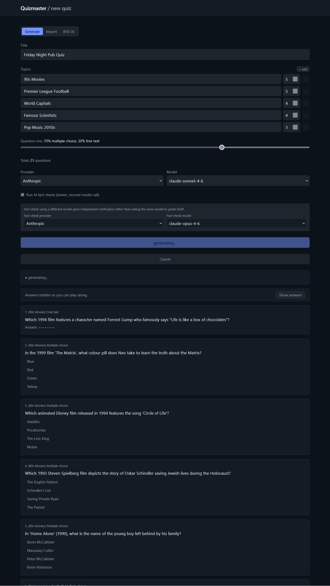
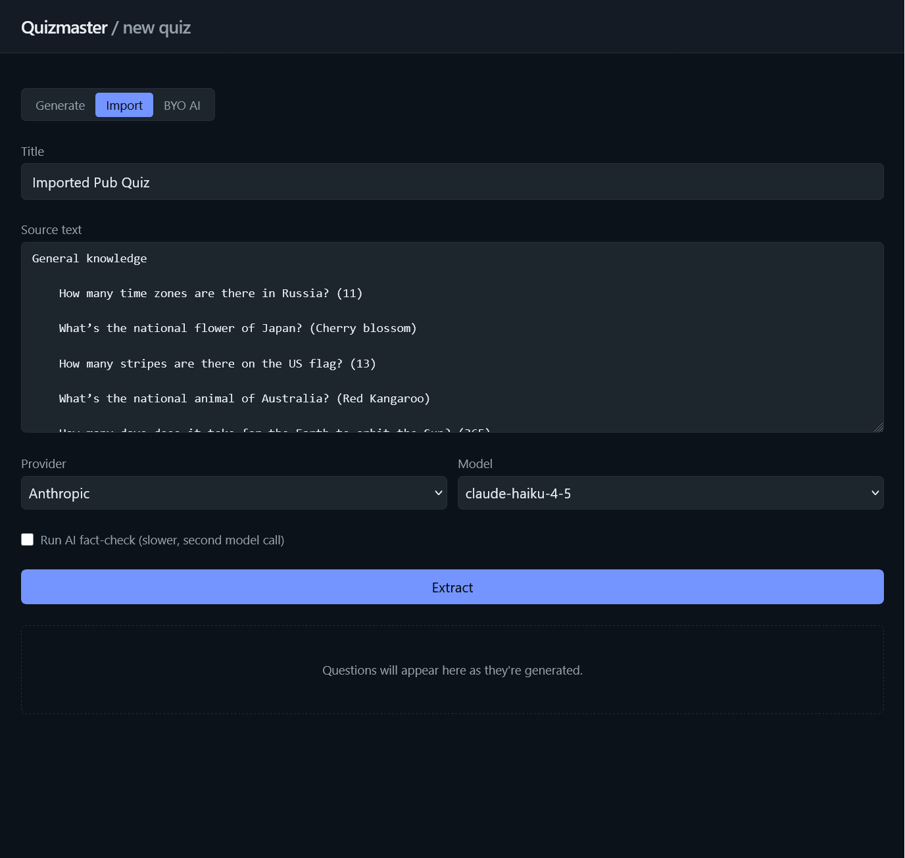
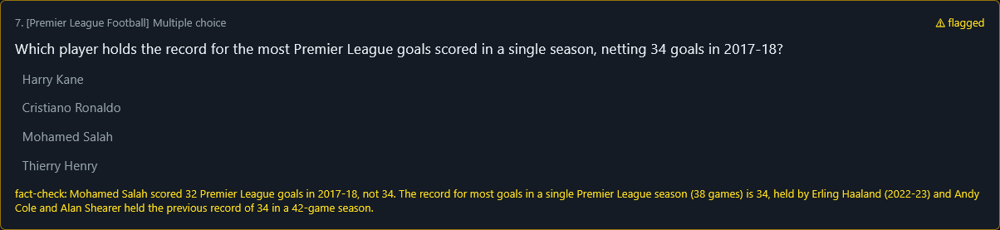

# Quizmaster

[](https://github.com/kieransouth/quizmaster/actions/workflows/build.yml)
[](LICENSE)

## It's
An AI-powered quiz wizard for team trivia nights — pick your provider, pick your topics, host the quiz from your browser.

## It's useful because
Writing a pub quiz from scratch takes an evening; doing it with any LLM takes thirty seconds. Quizmaster wraps that around a host UI so you can edit the dodgy questions, fact-check them with a second model, run a slideshow on a Discord screen-share, and grade on the spot.

## It's built with
- ASP.NET Core 10 + EF Core (Postgres)
- React + TypeScript + Vite + Tailwind v4
- [Microsoft.Extensions.AI](https://devblogs.microsoft.com/dotnet/introducing-microsoft-extensions-ai-preview/) talking to [Ollama](https://ollama.com), [OpenAI](https://platform.openai.com), and [Anthropic](https://www.anthropic.com)
- Server-Sent Events for the streaming generation pipeline
- Docker + Traefik (optional)

## It looks like


*Saved quizzes from your library — generated, imported, and BYO-AI sources side-by-side.*


*Topic builder with per-topic counts, MC/free-text mix, an optional second model for fact-checking, and questions streaming in as the model emits them.*


*Paste an existing quiz from anywhere — the AI extracts each Q+A into the schema. Or use **BYO AI** to skip the API call entirely: copy the prompt, run it in your tool of choice, paste the JSON back.*


*A separately-chosen model audits each question; flagged ones surface the disagreement so the host can fix them before play.*


*Slideshow play view, keyboard-first — 1–9 to pick, Enter to save and next, ←/→ to navigate.*


*Every team's answers side-by-side with the canonical answer, auto-graded with a manual override on the spot.*


*A read-only summary teams can revisit after the quiz.*

## You can host it

Pick whichever overlay fits your setup.

### Option A — Standalone (any reverse proxy in front, or none)

```bash
gh repo clone kieransouth/quizmaster && cd quizmaster
cp .env.example .env
# fill in POSTGRES_PASSWORD, JWT_SIGNING_KEY, AI provider keys, WEB_PORT
docker compose -f docker-compose.yml -f docker-compose.standalone.yml up -d --build
```

The web UI is published on `127.0.0.1:${WEB_PORT}` (default `8080`) and the web container reverse-proxies `/api` to the API, so a single host port serves the whole app. Point Caddy / nginx / Cloudflare Tunnel at it.

### Option B — Traefik (label-routed)

```bash
gh repo clone kieransouth/quizmaster && cd quizmaster
cp .env.example .env
# fill in QUIZMASTER_HOST, TRAEFIK_CERTRESOLVER, TRAEFIK_ENTRYPOINT (defaults to "websecure"), plus the secrets above
docker compose -f docker-compose.yml -f docker-compose.traefik.yml up -d --build
```

Assumes Traefik is already running on the external `web` network with your cert resolver registered.

## License
MIT.
