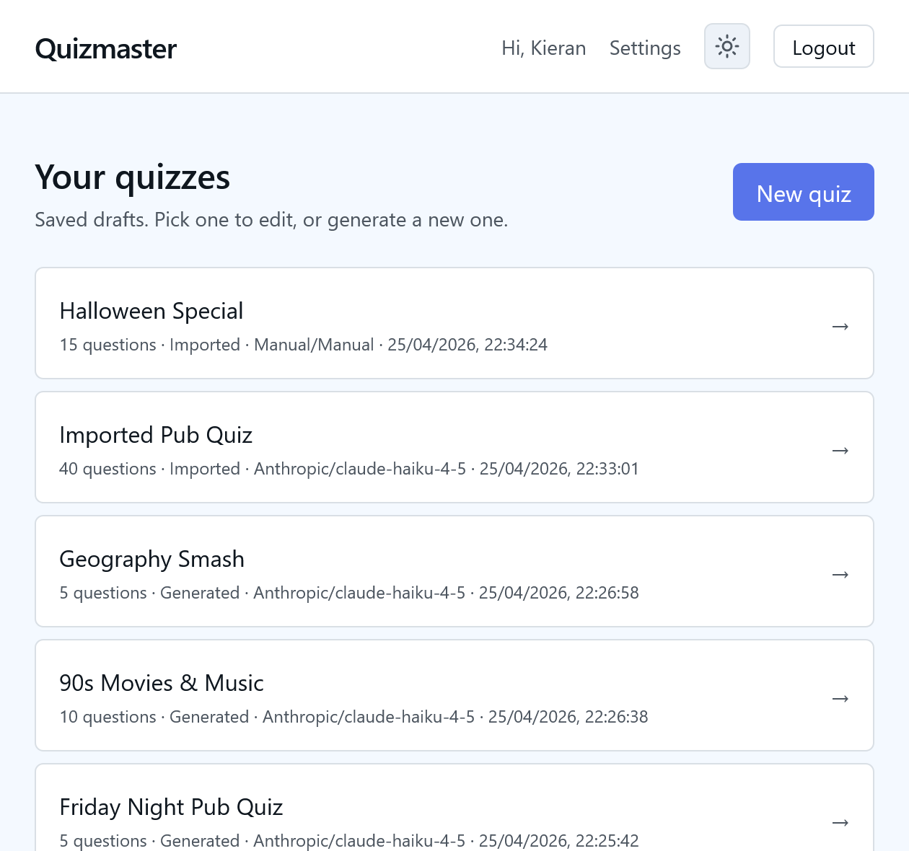
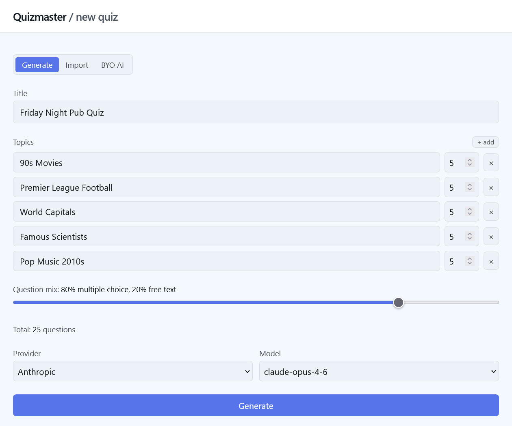
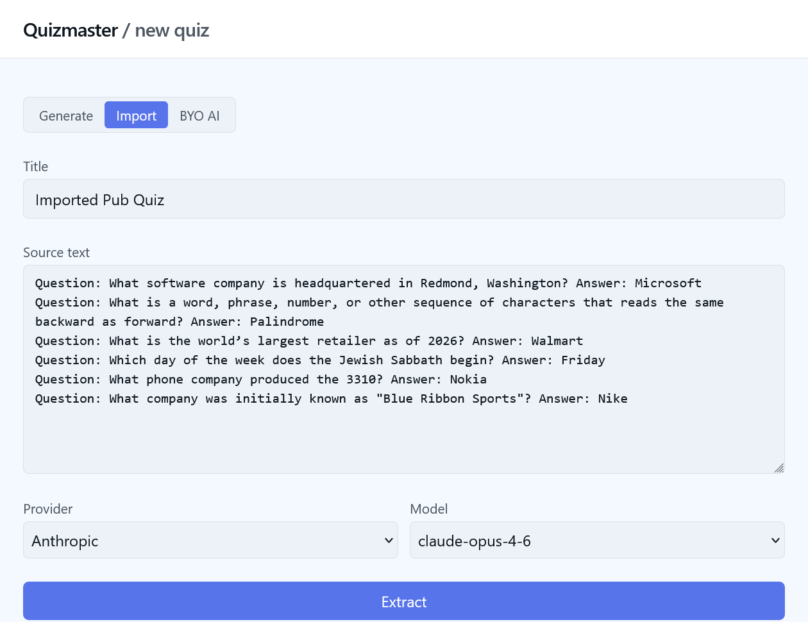
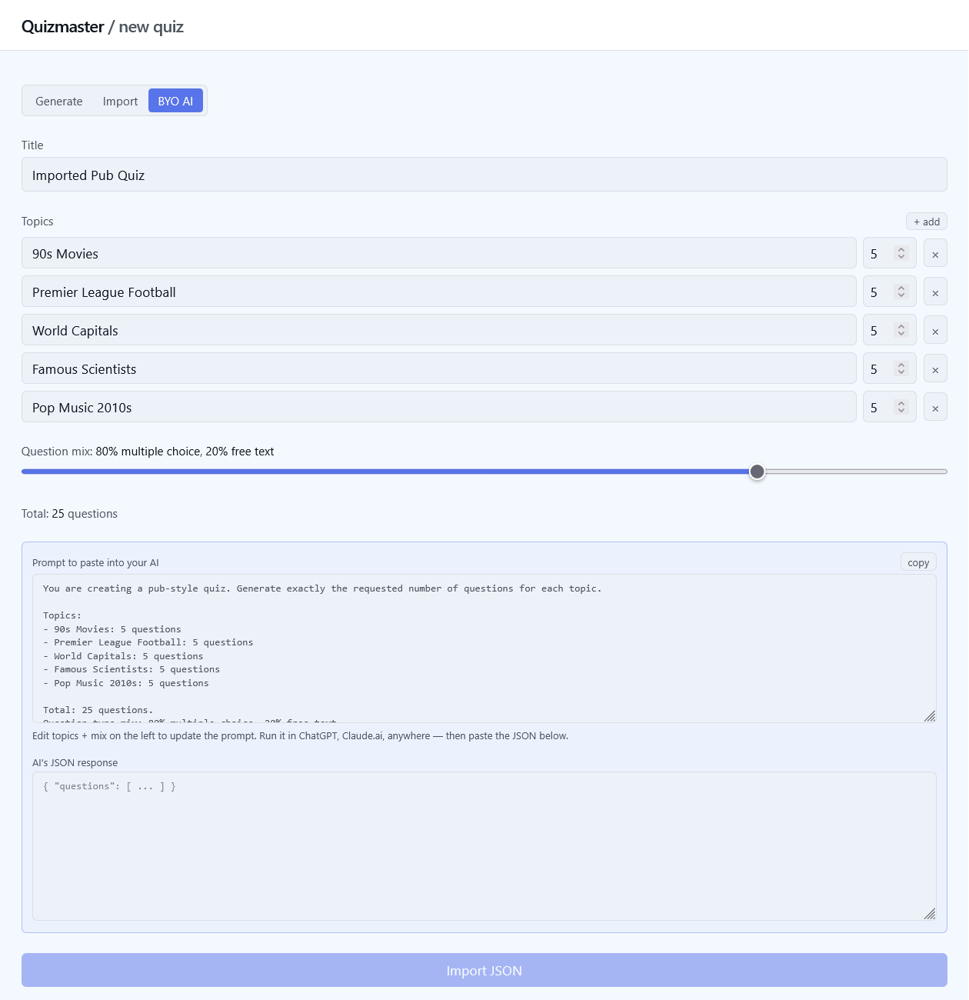
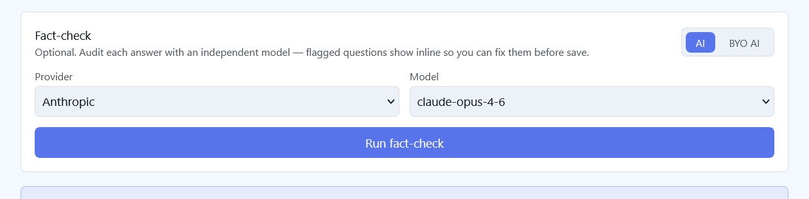
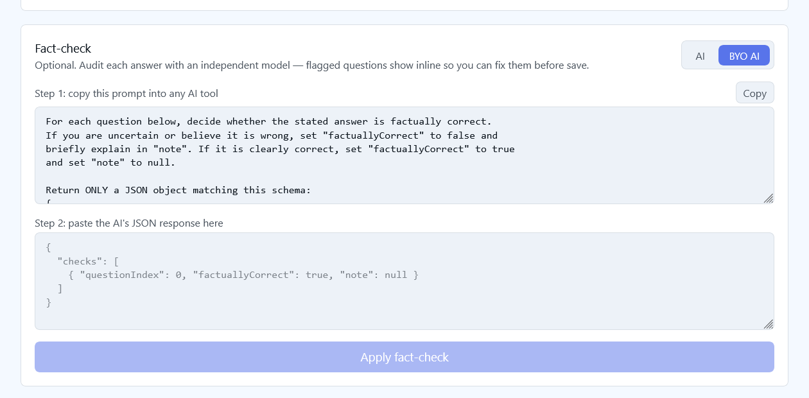
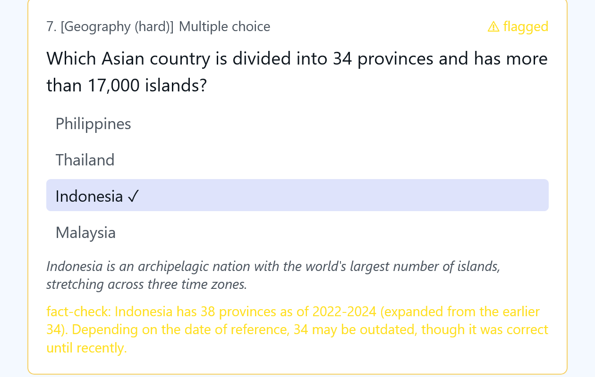
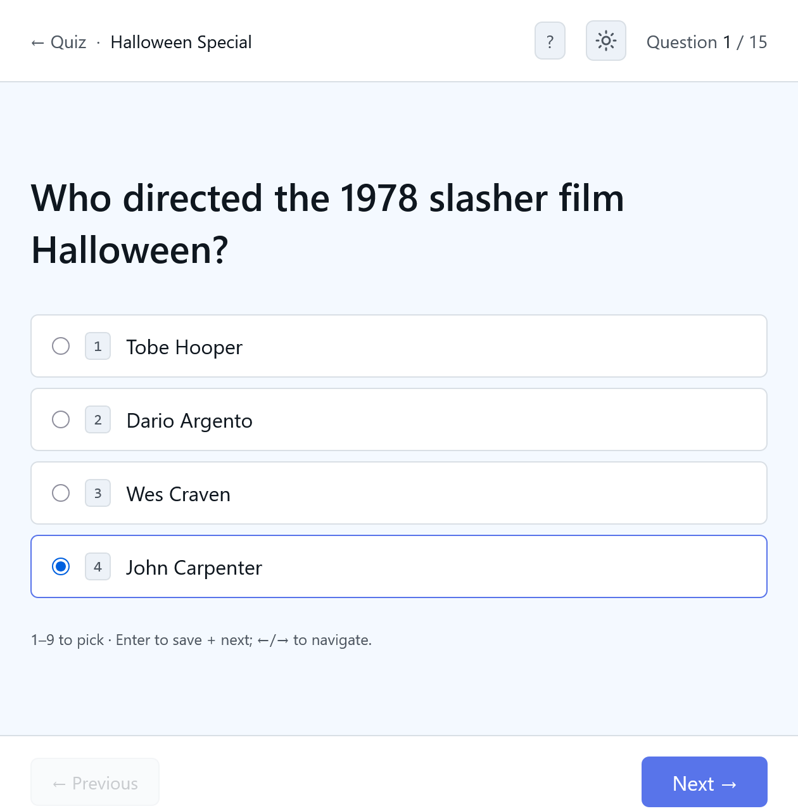
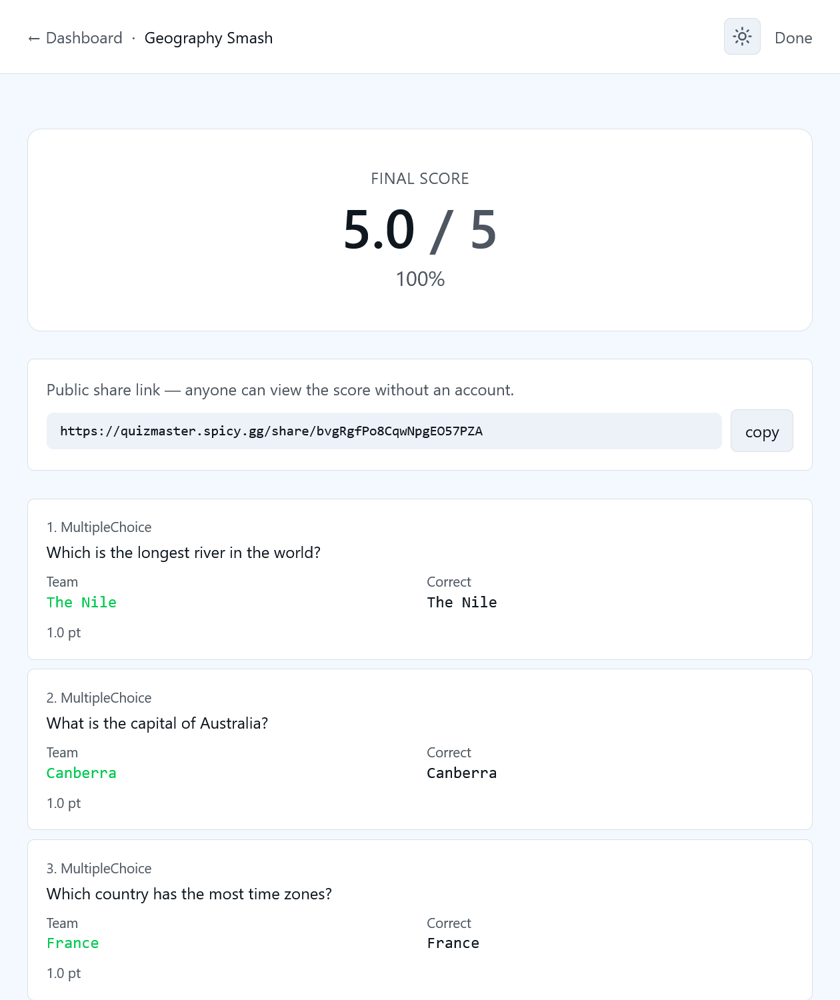
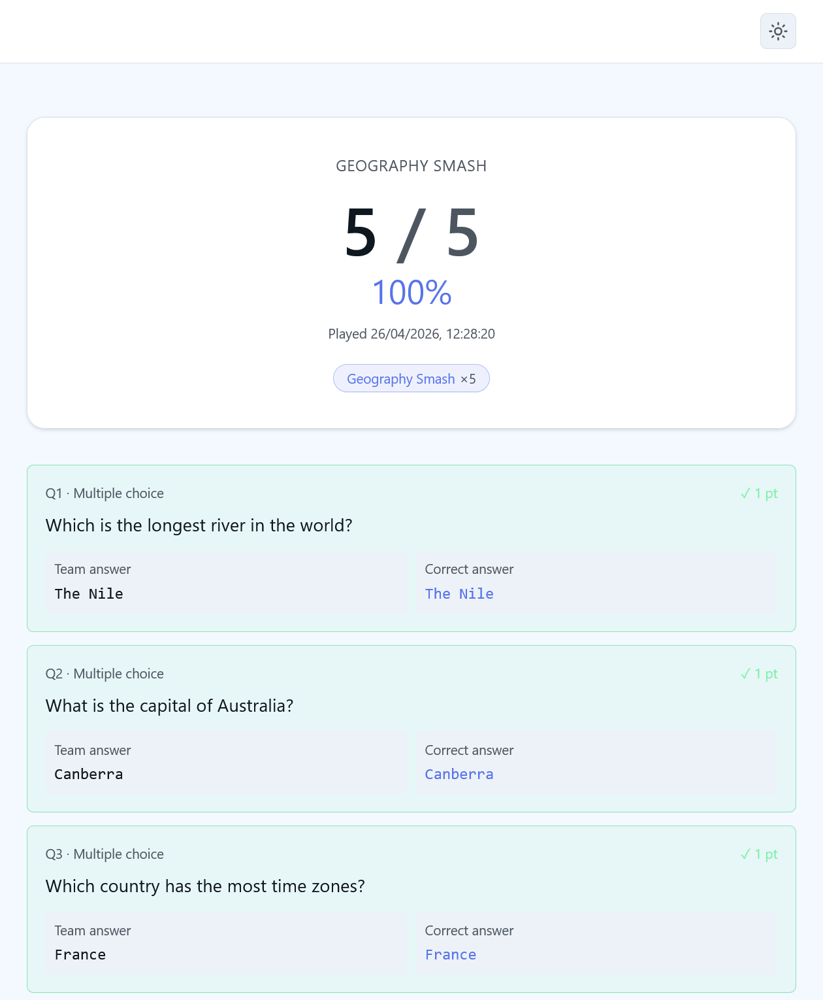

# Quizmaster

[](https://github.com/kieransouth/quizmaster/actions/workflows/build.yml)
[](LICENSE)

## It's
An AI-powered quiz wizard for team trivia nights — pick your provider, pick your topics, host the quiz from your browser.

## It's useful because
Writing a pub quiz from scratch takes an evening; doing it with any LLM takes thirty seconds. Quizmaster wraps that around a host UI so you can edit the dodgy questions, fact-check them with a second model, run a slideshow on a Discord screen-share, and grade on the spot.

## It's also running
A live instance lives at **[quizmaster.spicy.gg](https://quizmaster.spicy.gg)** — same code as this repo, not a hosted demo. Sign in, drop your OpenAI / Anthropic key into Settings (encrypted at rest, never visible to other users), and host a quiz. If you'd rather not provide a key at all, the BYO-AI flow lets you generate and fact-check entirely in your own AI tool of choice and just paste the JSON back.

## It's built with
- ASP.NET Core 10 + EF Core (Postgres)
- React + TypeScript + Vite + Tailwind v4
- [Microsoft.Extensions.AI](https://devblogs.microsoft.com/dotnet/introducing-microsoft-extensions-ai-preview/) talking to [Ollama](https://ollama.com), [OpenAI](https://platform.openai.com), and [Anthropic](https://www.anthropic.com)
- Server-Sent Events for the streaming generation pipeline
- Docker + Traefik (optional)

## It looks like

<!-- Click any thumbnail to view full size. -->
<table>
  <tr>
    <td align="center" valign="top" width="50%">
      <a href="docs/screenshots/home.png"></a>
      <br/><sub><b>Home</b> — saved quizzes side-by-side: generated, imported, BYO-AI.</sub>
    </td>
    <td align="center" valign="top" width="50%">
      <a href="docs/screenshots/new-generate.png"></a>
      <br/><sub><b>Generate</b> — topic builder, per-topic counts, MC/free-text mix, provider + model.</sub>
    </td>
  </tr>
  <tr>
    <td align="center" valign="top">
      <a href="docs/screenshots/new-import.png"></a>
      <br/><sub><b>Import</b> — paste an existing quiz; the AI extracts each Q+A into the schema.</sub>
    </td>
    <td align="center" valign="top">
      <a href="docs/screenshots/new-byo.png"></a>
      <br/><sub><b>BYO AI</b> — copy the prompt, run it in your tool of choice, paste the JSON back. No server-side AI calls.</sub>
    </td>
  </tr>
  <tr>
    <td align="center" valign="top">
      <a href="docs/screenshots/fact-check-ai.png"></a>
      <br/><sub><b>Fact-check (AI)</b> — separately-chosen model audits each question; flagged ones surface inline.</sub>
    </td>
    <td align="center" valign="top">
      <a href="docs/screenshots/fact-check-byo.png"></a>
      <br/><sub><b>Fact-check (BYO)</b> — same prompt-and-paste pattern as BYO generation. Audit a quiz with no API keys.</sub>
    </td>
  </tr>
  <tr>
    <td align="center" valign="top">
      <a href="docs/screenshots/fact-check-flagged.png"></a>
      <br/><sub><b>A flagged question</b> — the disagreement is surfaced inline so the host can fix it before play.</sub>
    </td>
    <td align="center" valign="top">
      <a href="docs/screenshots/play.png"></a>
      <br/><sub><b>Play</b> — keyboard-first slideshow. 1–9 to pick, Enter to save and next, ←/→ to navigate.</sub>
    </td>
  </tr>
  <tr>
    <td align="center" valign="top">
      <a href="docs/screenshots/reveal.png"></a>
      <br/><sub><b>Reveal &amp; grade</b> — final score, every team answer next to the canonical, public share link.</sub>
    </td>
    <td align="center" valign="top">
      <a href="docs/screenshots/share.png"></a>
      <br/><sub><b>Public share</b> — a read-only summary teams can revisit after the quiz.</sub>
    </td>
  </tr>
</table>

## You can host it

Pick whichever overlay fits your setup.

### Option A — Standalone (any reverse proxy in front, or none)

```bash
gh repo clone kieransouth/quizmaster && cd quizmaster
cp .env.example .env
# fill in POSTGRES_PASSWORD, JWT_SIGNING_KEY, WEB_PORT
docker compose -f docker-compose.yml -f docker-compose.standalone.yml up -d --build
```

The web UI is published on `127.0.0.1:${WEB_PORT}` (default `8080`) and the web container reverse-proxies `/api` to the API, so a single host port serves the whole app. Point Caddy / nginx / Cloudflare Tunnel at it.

OpenAI and Anthropic keys are **per-user** — log in and add yours from the Settings page; they're encrypted at rest with ASP.NET Data Protection. Ollama is the one provider Quizmaster shares server-wide; set `OLLAMA_ENABLED=false` in `.env` to hide it on a public deploy.

### Option B — Traefik (label-routed)

```bash
gh repo clone kieransouth/quizmaster && cd quizmaster
cp .env.example .env
# fill in QUIZMASTER_HOST, TRAEFIK_CERTRESOLVER, TRAEFIK_ENTRYPOINT (defaults to "websecure"), plus the secrets above
docker compose -f docker-compose.yml -f docker-compose.traefik.yml up -d --build
```

Assumes Traefik is already running on the external `web` network with your cert resolver registered.

## License
MIT.
